# Дашборд Aviasales

Конкурсная работа в системе Analytic Workspace

## Содержание

- [Превью](#превью)
- [Подготовка данных](#подготовка-данных)
  - [Очистка данных](#очистка-данных)
  - [Обогащение данных](#обогащение-данных)
    - [Авиакомпании](#авиакомпании)
    - [Аэропорты](#аэропорты)
    - [Календарь](#календарь)
  - [Модели данных](#модели-данных)
    - [Основная модель данных](#основная-модель-данных)
    - [Модель данных для фильтров](#модель-данных-для-фильтров)
  - [Композитные ключи](#композитные-ключи)
- [Дизайн](#дизайн)
  - [Шрифт](#шрифт)
  - [Цвета](#цвета)
  - [Border radius](#border-radius)
  - [Логотип](#логотип)
- [Кастомные виджеты](#кастомные-виджеты)
  - [Расширение экспорт](#расширение-экспорт)
    - [Интеграция](#интеграция)
- [Ошибки](#ошибки)

## Превью

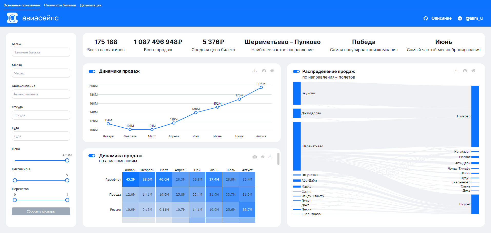
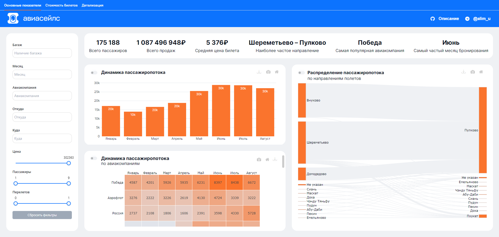
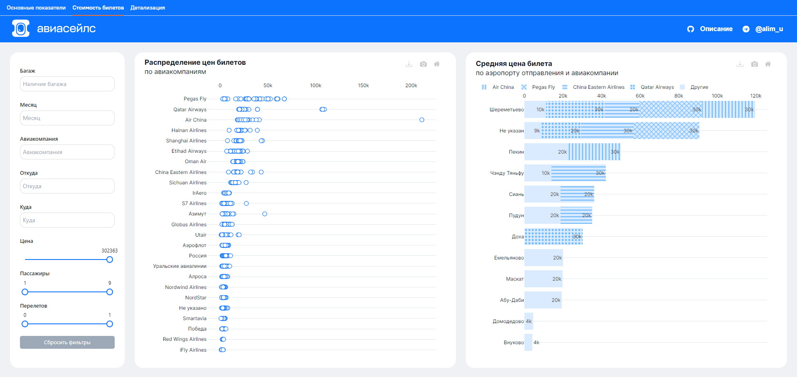
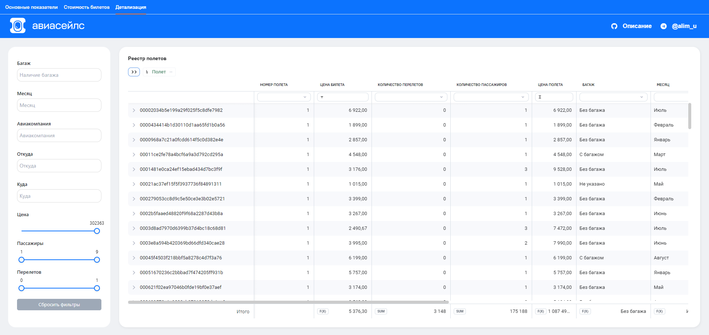

> Дашборд тестировался для разрешения 1920x1080 в стандартном chrome браузере с включенной панелью закладок. При возникновении горизонтальных/вертикальных скролов, рекомендуется использовать данный формат для просмотра.

> Внутренняя ссылка на дашборд – <https://aw-demo.ru/share/dashboard/vg7LgnxXNUK6D5-0alzqXbBf929thEb5l>

## Подготовка данных

### Очистка данных

[[aviasales_cleaned.sql]](sql/aviasales_cleaned.sql)

- нормализированы данные о полетах
  - добавлены новые колонки
    - `origin_code`, `NOT NULL` – код аэропорта отправления, `Не указан` в случае отсутствия значения
    - `destination_code` `NOT NULL` – код аэропорта прибытия, `Не указан` в случае отсутствия значения
    - `airline_code` `NOT NULL` – код авиакомпании, `Не указан` в случае отсутствия значения
    - `baggage` `NOT NULL` – флаг наличия багажа, значение переведено на русский. `Не указано` в случае отсутствия значения
  - на каждый перелет создана отдельная строка
  - добавлена колонка `flight_subseq` отображающая номер перелета, из расчета, что информация о перелетах в изначальном списке указаны в хронологическом порядке
  - добавлена колока `subseq_num` показывающая сколько было всего перелетов в рамках одного полета
  - добавлена колока `avg_price_person`, показывающая среднюю цену одного перелета на пассажира

Промежуточные результаты:
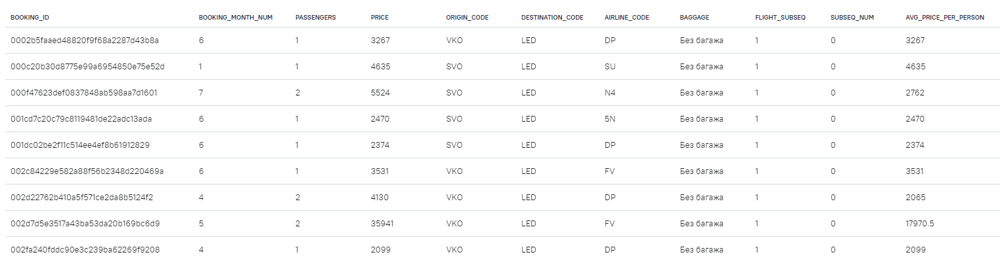

### Обогащение данных

#### Авиакомпании

[[airlines.sql]](sql/airlines.sql)

Сформирована таблица `airline`, на основе уникальных значений колонки `AIRLINE_CODE` и информации взятой с <https://www.aviasales.ru/airlines>

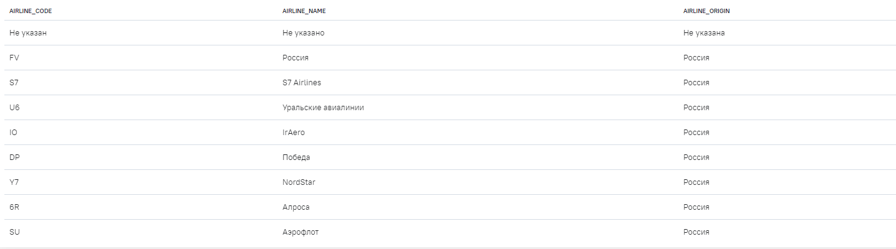

#### Аэропорты

[[airport_origin_destination.sql]](sql/airport_origin_destination.sql)

Сформированы две аналогичные таблицы `airport_[origin | destination]` на основе:

- сета уникальных значений колонок `ORIGIN_CODE` и `DESTINATION_CODE`
- информации о аэропортах взятой с <https://www.aviasales.ru/airports>
- 3-х значными кодами стран, по стандарту ISO 3166-1 alpha-3 <https://en.wikipedia.org/wiki/ISO_3166-1_alpha-3>

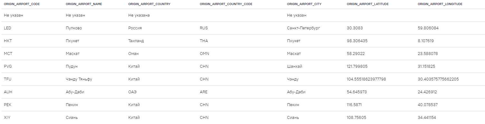

#### Календарь

- Сформирована таблица `calendar` с названиями месяцев на русском языке. [[calendar.sql]](sql/calendar.sql)

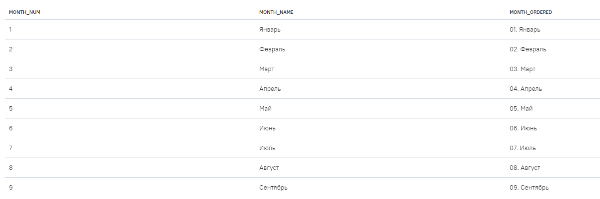

### Модели данных

#### Основная модель данных

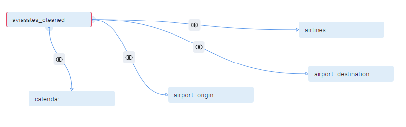

#### Модель данных для фильтров

Для создания панели с фильтрами была сформирована отдельная модель, включающая агрегированные данные [[filters.sql]](sql/filters.sql)

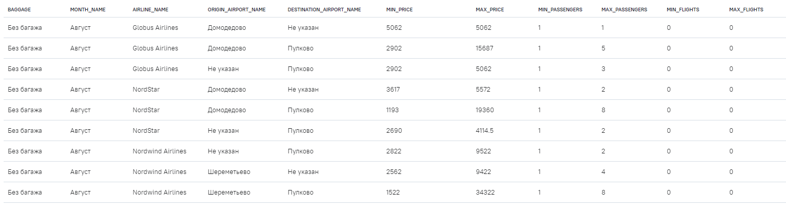

### Композитные ключи

Поскольку на данный момент в Analytic Workspace в java script передается только одна группа для агрегатов, созданы композитные ключи которые используются для передачи нескольких уникальных значений как одной колонки

- Композитный ключ `Направление`

  Ключ представляющий сочетание колонок `Аэропорт отправления` и `Аэропорт прибытия`, разделенных запятой. Необходим для визуализации пассажиропотока и прибыли в разрезе аэропортов в [sankey](widgets/sankey/)

- Композитный ключ `Авиакомпания месяц`

  Ключ представляющий сочетание колонок `Авиакомпания` и `Месяц`, разделенных запятой. Необходим для визуализации пассажиропотока и прибыли в динамике в разрезе авиакомпаний в [heatmap](widgets/heatmap/)

- Композитный ключ `Аэропорт отправления Авиакомпания`
  Ключ представляющий сочетание колонок `Аэропорт отправления` и `Авиакомпания`, разделенных запятой. Необходим для визуализации средней цены билета по аэропортам и авиакомпаниям в [stacked barchart](widgets/stacked%20barchart/)

## Дизайн

Дизайн основан на css стилях взятых с [aviasales.ru](https://www.aviasales.ru/)

### Шрифт

```css
--brand-text-font-family: Stapel, -apple-system BlinkMacSystemFont, Inter, Roboto, Helvetica, Arial, sans-serif;
```

Взят наиболее приоритетный доступный из стилей (`Inter`)

### Цвета

```css
--brand_primary_800: #0656fe;
--brand_primary_500: #0c73fe;
--brand_primary_300: #6ebaff;
--brand_primary_200: #a3d3ff;
--brand_primary_50: #daeaff;
--brand_primary_25: #e8f4ff;

--orange_500: #fa742d;

--white: #fff;

--ink_50: #eff1f4;
--ink_150: #e1e5ec;
--ink_300: #cdd4de;
--ink_400: #9ea9b7;
--ink_500: #5a6472;
--ink_500_alpha_60: rgba(90, 100, 114, 0.6);
--ink_500_alpha_12: rgba(90, 100, 114, 0.12);

--text_primary: var(--ink_800)
```

- Акцентный цвет `brand_primary_500`
- Альтернативный акцентный цвет `orange_500`
- Черный `text_primary`
- Белый `white`

### Border radius

Основные значения найденные для элементов

- `10px`
- `14px`
- `16px`
- `20px`

### Логотип

Взяты логотип и название в формате svg с заменой всех значений параметра `fill` с `currentColor` на `#fff`

## Кастомные виджеты

Список кастомных виджетов с ссылками на код:

- [kpi](widgets/kpi/)
- [barchart/line plot](widgets/barchart%20line%20plot/)
- [sankey](widgets/sankey/)
- [heatmap](widgets/heatmap/)
- [scatter](widgets/scatter/)
- [stacked barchart](widgets/stacked%20barchart/)
- [filter panel](widgets/filter%20panel/)

### Расширение экспорт

Все основные графики реализованны с помощью plotly имеют расширение экспорт.

Дает возможность экспорта агрегированных данных, в том виде, в котором они были переданы в javascript, в нормализированном табличном виде. Доступно две опции:

- Экспорт в формате csv
- Экспорт в формате excel

#### Интеграция

Для использования функционала расширения:

- в визуализации подключены `export.css` и `export.js`
- в html код встроен объект `<div class="export-wrapper"></div>`
- в css настроены атрибуты `top` и `right` для `.export-wrapper`
- в функции render инициализирована функция `setupExportButtons`

## Ошибки

- Вместо cdn были использованы локальные импорты, т.к. были замечены случаи когда загрузка библиотек через cdn занимала слишком много времени (10 сек. и более)

- Для bootstrap-icons.css пришлось изменить загрузку файлов bootstrap-icons.woff и bootstrap-icons.woff2 на локальные импорты

- Часть данных в модели являются избыточными и не были использованы для конечного дашборда
  - Предполагалось, что координаты и коды стран будут использованы для карты с 3 типами визуализации – визуализация продаж с помощью choropleth, направлений полетов с помощью линий, где толщина линии определяется количеством пассажиров и scatter, в котором размер определяется средней ценой билета, но в конечном итоге я отказался от данной визуализации т.к. не увидел в ней смысла – карта выглядела как визуальная каша, без особых инсайтов
  - Вычисляемое поле `Аэропорт прибытия Авиакомпания` должно было использоваться для treemap, однако построив визуализацию я не увидел в ней никакой ценности

- Весь код написанный на js для кастомных визуализаций ужасен – я не знаю ничего про js, даже основной синтаксис, поэтому присутсвует множество бойлерплейта и спагетти-кода, т.к. нет понимания основных концепций языка или best practices

- Отдельные переключатели между пассажиропотоком и продажами на вкладке `Основые показатели` выглядят сомнительно – чтобы полностью переключится с одного состояния на другое нужно кликнуть 3 раза вместо одного, что сильно влияет на юзабилити. Однако я не нашел нормальной реализации подобного функционала через фильтрацию. Нет никакого способа реализовать коллбэк из одного iframe в другие.


- Хотя в использовании оранжевого для пассажиропотока и синего для продаж присутствует консистентность, как таковой причины использования именно этих цветов для данных показателей нет. Иными словами, нет никакой связи или физического смысла между, например, количеством пассажиров и оранжевым. В то же время, синий и оранжевый хорошо кодируют high/low значения, что можно было бы использовать для расстановки акцентов иным образом.

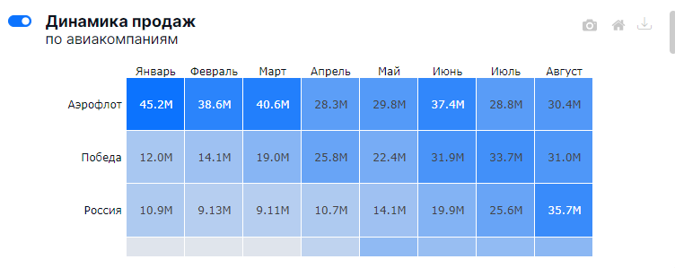
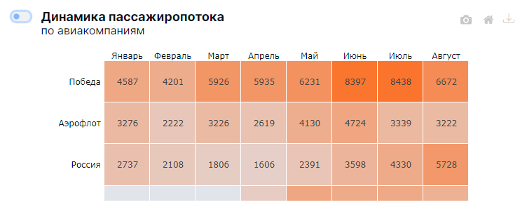

- Другим аспектом является использование синего меньшей яркости для цены билета на вкладке `Стоимость билета`. Хотя с одной стороны это является консистентым с продажами, т.к. это величины в одинаковых единицах измерения, с другой цены билетов являются в данном случае отдельной атомарной сущностью, для которой, возможно, стоило использовать свой, комплиментарный к синему и оранжевому, цвет

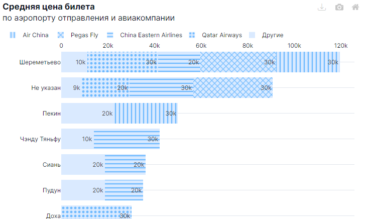

- Использование паттернов затрудняет чтение подписей с ценами на билеты

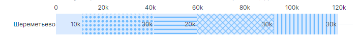

- Сортировка по сумме средних цен билетов и группировка по аэропортам не имеет смысла, т.к. цены на билеты в рамках различных авиакомпаний это независимые сущности. Это создает иллюзию, будто для одного аэропорта, для которого представлено две авиакомпании, средняя цена выше чем для другого, где есть только одна авиакомпания хотя в реальности это может быть не так

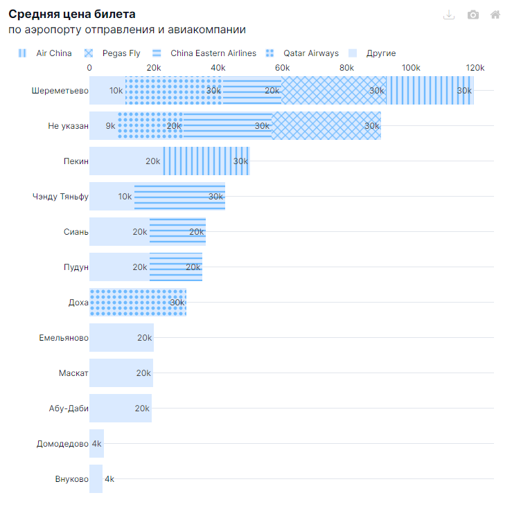

- Все переключатели после переключения на пассажиропоток остаются в фокусе, однако цвет обводки при этом синий, а не оранжевый, что не является консистентным

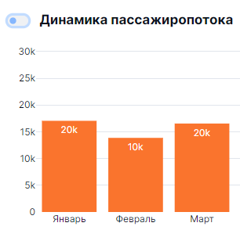

- Черный цвет плохо читаем на синем

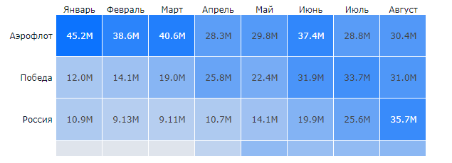

- Для sankey нет подписей что сильно снижает юзабилити – каждый раз чтобы посмотреть конкретные значения, нужно навести мышкой. Я не нашел способа как добавить значения

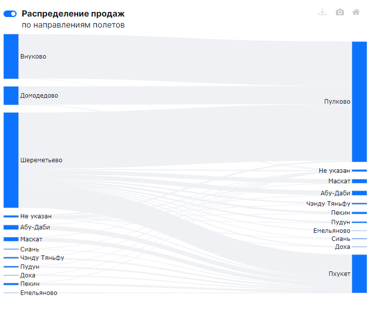

- При наведении на линки, их цвет становится голубым, даже при переключении на пассажиропоток, что не является консистентым

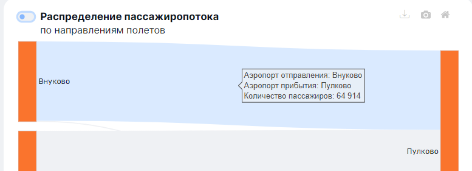

- Нет консистентности в нейминге kpi. В первом случае используется `Наиболее`, в двух других `Самое`. Однако использовать `Самое` для первого случая, или `Наиболее` для двух других, звучит хуже, чем выбранные варианты


- Описания kpi слишком длинные


- Таблица на вкладке `Детализация` является стандартным виджетом и не вписывается в общий стиль. Причиной является то, что я не хотел прокидывать на client side 100K+ строк, что было бы неизбежно при использовании кастомной визуализации, т.к. на данный момент нет никакой реализации api запросов с пагинацией.

- Все дропдауны имеют стандартные bootstrap рамки, которые никак не обоснованы с точки зрения стиля aviasales


- Плейсхолдеры в дропдаунах дублируют их заголовки и не несут какой-то смысловой нагрузки, также являясь описательными а не call to action


- Все слайдеры имеют плохое юзабилити – нет возможности задать конкретные значения в input полях, которые можно было бы реализовать, например поверх выбранных чисел над слайдерами.

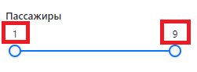

- Слайдер с ценой билета малофункционален, т.к. позволяет выставить только верхнюю границу. Причиной является то, что `setFilter` не работает дважды для одного показателя, т.е. для непрерывных величин нельзя выставить значение between. Для двух других фильтров данное ограничение можно было обойти, т.к. де-факто значения являются категориальными, поэтому в `setFilter` была возможность передать весь массив выбранных значений.

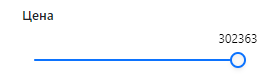

- Хотя `setupExportButtons` вызывается в функции `render`, после применении фильтров экспорт возвращает все данные, а не только отфильтрованные

- Кнопка экспорта плохо интегрирована со стандартными кнопками из plotly – иконка слишком тонкая и сильно контрастирует по стилю, не реализована подсказка при наведении, с помощью `:after`, `:before` по аналогии с тем который используется в plotly. Стандартне подсказки plotly не переведены на русский.


- Функционал фильтрации имеет очень странное поведение – при фильтре на одной странице, фильтрация сохраняется для другой, но сброс фильтров не работает. Причина заключается в том, что на новой странице происходит повторный рендер панели с фильтрами, однако в объект `window.DATA`, *передаются только отфильтрованные* на предыдущей странице данные. В качестве загрушки, поверх кнопки `Сбросить фильтры` добавлена кнопка, которая перезагружает всю страницу.

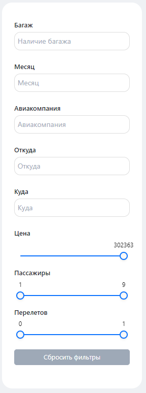
